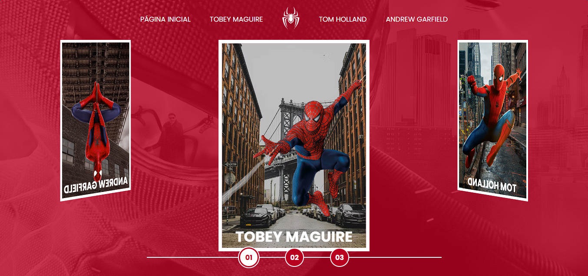
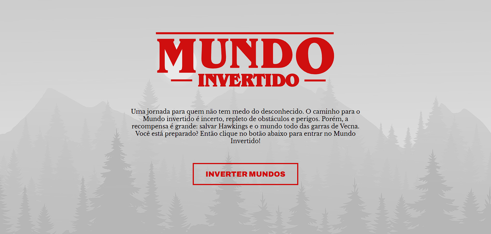
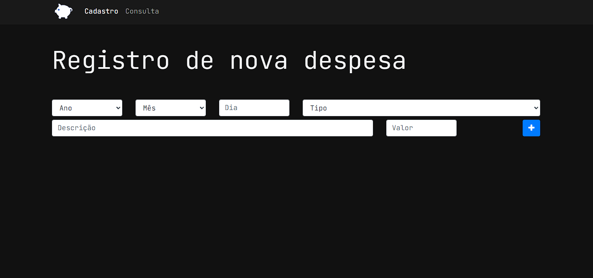
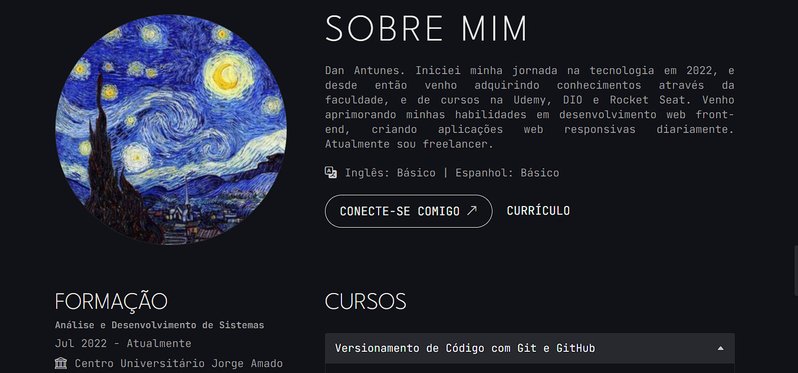

  

  

<h3> 👨💻 Desenvolvedor Front-End </h3>
 

**🎯 Sobre Mim**  
Desenvolvedor Front-End Júnior com experiência em criação de interfaces web responsivas e sistemas integrados. Atualmente combinando:
- 💼 Freelance em desenvolvimento web
- 🎓 Último ano de Analise e Desenvolvimento de Sistemas
- 🎨 Paixão por design 

---

## 🛠️ Tecnologias

### 💡 Principais Stacks

<!--- Seção de Análise GitHub -->

  
<b>📊 GitHub Analytics</b>

   
  <a href="https://github.com/DanAntunes">
  <table>
  <tr>
    <td>
      
    </td>
    <td>
      
    </td>
    <td>
      
    </td>
  </tr>
</table>

   
  </a>

<!-- 🚀 Projetos Recentes -->

  
<b>🚀 Projetos Recentes</b>

   

  

   

      <!-- Seção de texto -->
      

        <ul style="list-style: none; padding: 0; margin: 0; text-align: center; line-height: 1.5;">
          <li><strong>🕸️ Spider-Man Multiverso</strong></li>
          <li>Website Interativo com Efeitos 3D</li>
          <li>✔️ Carrossel 3D de diferentes versões</li>
          <li>🎮 Animações CSS complexas e responsivas</li>
          <li>🌐 Integração com Google Fonts</li>
          <li style="margin-top: 1rem;">
            
          </li>
        </ul>
      

      <!-- Seção de imagem -->
      

        
      

    

  

      <!-- Seção de texto -->
      

        <ul style="list-style: none; padding: 0; margin: 0; text-align: center; line-height: 1.5;">
          <li><strong>🌌 Mundo Invertido</strong></li>
          <li>Landing Page Temática de Stranger Things</li>
          <li>✔️ Alternância dinâmica claro/escuro</li>
          <li>✔️ Player de vídeo integrado</li>
          <li>✔️ Design totalmente responsivo</li>
          <li style="margin-top: 1rem;">
            
          </li>
        </ul>
      

      <!-- Seção de imagem -->
      

        
      

    

  

      <!-- Seção de texto -->
      

        <ul style="list-style: none; padding: 0; margin: 0; text-align: center; line-height: 1.5;">
          <li><strong>💰 App Orçamento Pessoal</strong></li>
          <li>Gerenciador Financeiro Inteligente</li>
          <li>✔️ CRUD completo com LocalStorage</li>
          <li>📊 Gráficos dinâmicos de acompanhamento</li>
          <li>🎨 Interface intuitiva com Bootstrap 5</li>
          <li style="margin-top: 1rem;">
            
          </li>
        </ul>
      

      <!-- Seção de imagem -->
      

        
      

    

  

      <!-- Seção de texto -->
      

        <ul style="list-style: none; padding: 0; margin: 0; text-align: center; line-height: 1.5;">
          <li><strong>🎨 Portfólio Profissional</strong></li>
          <li>Website Pessoal com Dark Mode</li>
          <li>🌗 Alternância de temas dinâmica</li>
          <li>📊 Seção de habilidades interativas</li>
          <li>📱 Design totalmente responsivo</li>
          <li style="margin-top: 1rem;">
            
          </li>
        </ul>
      

      <!-- Seção de imagem -->
      

        
      

    

   

      <!-- Seção de texto -->
      

        <ul style="list-style: none; padding: 0; margin: 0; text-align: center; line-height: 1.5;">
          <li><strong>📝 To Do List - Dark Forest</strong></li>
          <li>Gerenciador de Tarefas Moderno</li>
          <li>✔️ Persistência com Local Storage</li>
          <li>🌑 Tema escuro minimalista</li>
          <li>📱 Design totalmente responsivo</li>
          <li style="margin-top: 1rem;">
            
          </li>
        </ul>
      

      <!-- Seção de imagem -->
      

        
      

    

  

<!-- Atividades Recentes -->
<!--START_SECTION:activity-->
1. 🌐 Criando um site chamado app help desk
2. 📝 Estudando PHP  
3. 📁 Estudando estrutura de pastas para projetos  
4. 🎉 Novo release do Spider-Man Multiverso  
5. 🎨 Atualização do design system
<!--END_SECTION:activity-->

---

## 📬 Contato

)

  <picture style="display: inline-block; width: 100%;">
    <source media="(prefers-color-scheme: dark)" srcset="https://raw.githubusercontent.com/DanAntunes/DanAntunes/output/github-contribution-grid-snake-dark.svg">
    <source media="(prefers-color-scheme: light)" srcset="https://raw.githubusercontent.com/DanAntunes/DanAntunes/output/github-contribution-grid-snake.svg">
    
  </picture>

